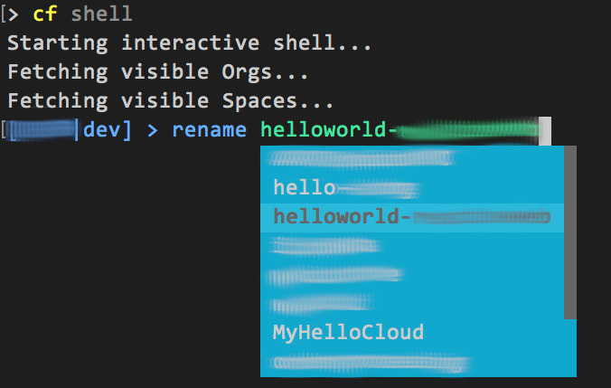

# cf-shell - A Shell for Cloud Foundry Commands with Auto-Completion

cf-shell is a simple plugin for the Cloud Foundry *cf* command line tool which
supports auto-completion of *cf* arguments. Its a fork of <https://github.com/dgruber/cf-shell> with some additional features and improvements. It makes it easy exploring arguments and its options without browsing through the help pages.

## Additional Features

- Added support for Windows platform
  - Supports both cmd Command Line tool and PowerShell.
  - Note the support is not perfect. The plugin depends on _go_prompt_ which has some rendering issues when the shell window is resized on Windows. The issue is being tracked and hopefully will be resolved in the future.
- Added support for *cf* command aliases
- Improved support for shell commands
  - The original version supports only a handful of shell commands. The new version passes any non-cf commands to the shell to be executed.
- Auto-complete now supports app name, organization name, service name and space name.
  - The names are cached locally and may become out of sync with the server. To refresh local cache simply run the command that lists all names. For example run _app_ or _a_ will refresh the app name cache.

## Installation

### By Source

```sh
mkdir -p $GOPATH/src/github.com/zhusulai
cd $GOPATH/src/github.com/zhusulai
git clone $GOPATH/src/github.com/zhusulai/cf-shell
cd cf-shell
go build
cf install-plugin -f ./cf-shell
```

## Usage

```sh
cf shell
```

Typing _quit_ or _exit_ (or ctrl-d) closes the shell.

## Uninstall plugin

```sh
cf uninstall-plugin Shell
```

## Screenshots

Command Description\


Command Arguments]\


Command Alias\


Auto Complete App Name\


Shell Command\
